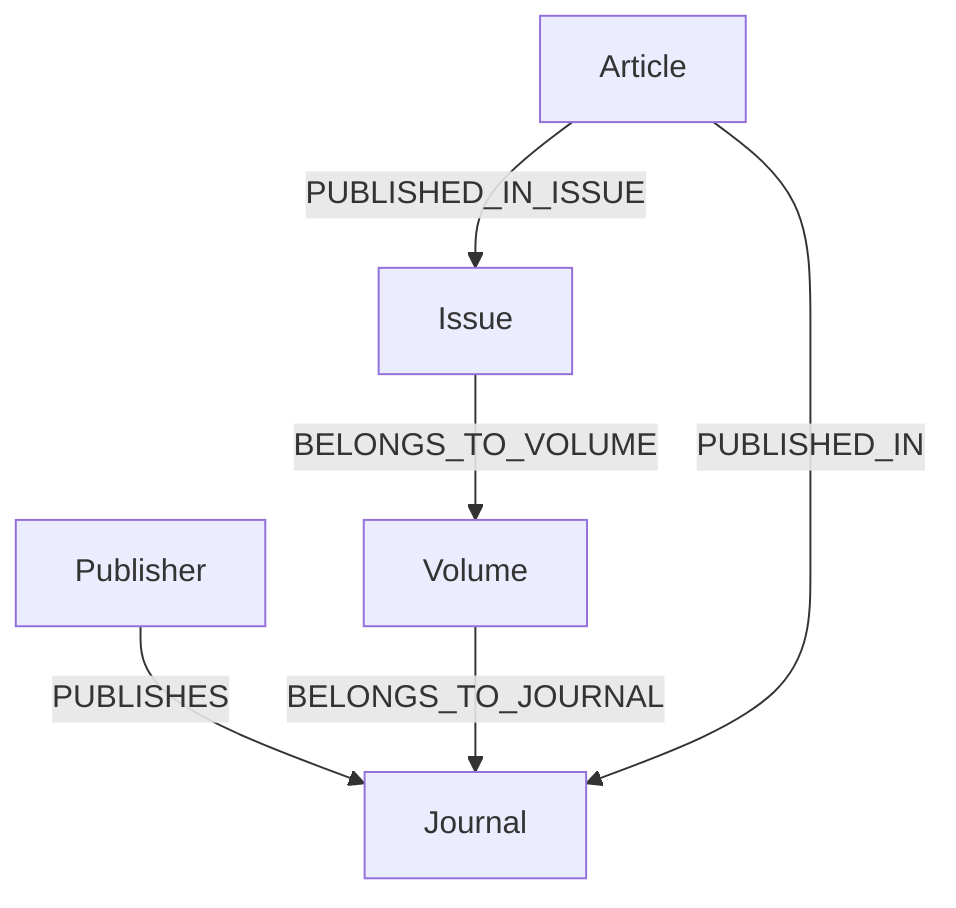
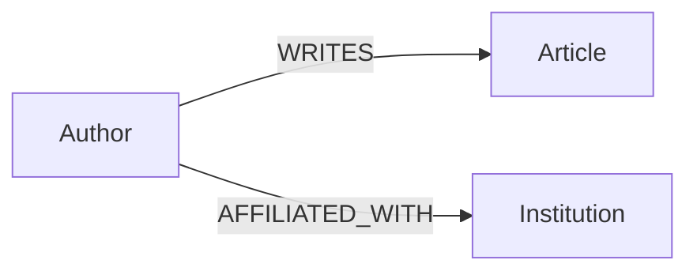
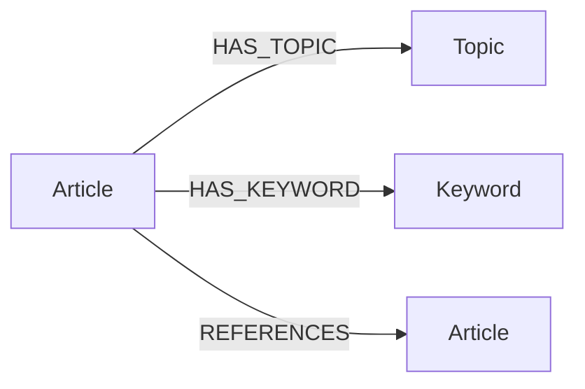
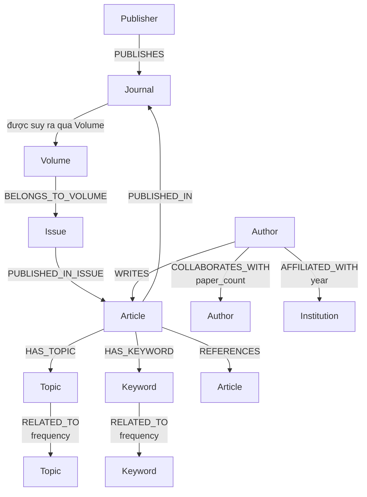

# Cấu trúc Tool PostgreSQL -> Neo4j

Tài liệu này tổng hợp cấu trúc hiện tại của tool đồng bộ dữ liệu nghiên cứu từ PostgreSQL sang Neo4j, tập trung vào node, thuộc tính, relationship và thứ tự xây dựng graph.

## 1. Phạm vi và nguồn sự thật

- PostgreSQL là nguồn dữ liệu chính. Tool chỉ đọc PostgreSQL và ghi sang Neo4j.
- Luồng thực thi hiện tại nằm tập trung trong [src/main.py](src/main.py).
- Các câu lệnh Cypher được chạy trong một Neo4j session và xử lý theo lô bằng `UNWIND`.
- Mỗi lô mặc định có tối đa 500 bản ghi; citation dùng lô 100; các mạng lưới derived dùng lô 250.
- `--limit` giới hạn số bản ghi được đọc cho từng entity, không phải tổng số bản ghi của toàn bộ graph.
- `--type full` và `--type incremental` hiện cùng gọi một hàm sync và chưa có logic phát hiện thay đổi riêng. Khi chạy `--loop`, tool thực hiện lại chu kỳ sau 24 giờ.

### Thành phần runtime

```text
PostgreSQL
    |
    | psycopg2 SELECT
    v
src/main.py
    |
    | neo4j.Driver + session.run(Cypher)
    v
Neo4j 5.14 Community hoặc Neo4j Aura
```

Neo4j được cấu hình theo thứ tự:

1. Dùng `NEO4J_URI` nếu có, ví dụ `neo4j+s://...` hoặc `bolt://...`.
2. Nếu không có, fallback về `bolt://NEO4J_HOST:NEO4J_PORT`.
3. Username ưu tiên `NEO4J_USERNAME`, sau đó là `NEO4J_USER`.
4. Password lấy từ `NEO4J_PASSWORD`.

## 2. Schema Neo4j

### 2.1 Constraints và index

Khi bắt đầu mỗi lần sync, tool tạo các uniqueness constraint sau nếu chưa tồn tại:

| Constraint | Label | Property duy nhất | Mục đích |
|---|---|---|---|
| `publisher_id_constraint` | `Publisher` | `id` | Định danh publisher |
| `journal_id_constraint` | `Journal` | `id` | Định danh journal |
| `volume_id_constraint` | `Volume` | `id` | Định danh volume |
| `issue_id_constraint` | `Issue` | `id` | Định danh issue |
| `author_id_constraint` | `Author` | `id` | Định danh author |
| `article_id_constraint` | `Article` | `id` | Định danh article thật |
| `topic_id_constraint` | `Topic` | `id` | Định danh topic |
| `keyword_id_constraint` | `Keyword` | `id` | Định danh keyword |
| `institution_id_constraint` | `Institution` | `id` | Định danh institution |

Index bổ sung:

```cypher
CREATE INDEX article_doi_idx IF NOT EXISTS
FOR (a:Article) ON (a.doi)
```

`Article.id` là khóa merge chính. `Article.doi` chỉ có index, không phải uniqueness constraint, vì citation placeholder được tạo tạm theo DOI.

## 3. Các node đang được tạo thực tế

Các node dưới đây đều được tạo bằng `MERGE`, với khóa nhận diện là `id` (ngoại trừ Article placeholder được nhận diện tạm bằng `doi`). `SET` sẽ cập nhật lại thuộc tính khi chạy sync lần sau.

| Label | PostgreSQL source | Khóa `MERGE` | Thuộc tính được ghi |
|---|---|---|---|
| `Publisher` | `Publisher` | `id = publisher_id` | `name` |
| `Journal` | `Journal` | `id = journal_id` | `name`, `type`, `open_access`, `diamond_oa`, `issn` |
| `Volume` | `Volume` | `id = volume_id` | `volume_number`, `publication_year` |
| `Issue` | `Issue` | `id = issue_id` | `issue_number`, `publication_year` |
| `Author` | `Author` | `id = author_id` | `name`, `h_index`, `cited_by_count` |
| `Institution` | `Institution` | `id = institution_id` | `name`, `type` |
| `Article` | `Article` | `id = article_id` | `title`, `doi`, `publication_year` |
| `Topic` | `Topic` | `id = topic_id` | `name` |
| `Keyword` | `Keyword` | `id = keyword_id` | `name` |

### 3.1 Mẫu node

```cypher
(:Publisher {id: <publisher_id>, name: <display_name>})

(:Journal {
  id: <journal_id>,
  name: <display_name>,
  type: <type>,
  open_access: <is_open_access>,
  diamond_oa: <is_oa_diamond>,
  issn: <issn>
})

(:Article {
  id: <article_id>,
  title: <title>,
  doi: <doi_lowercase_or_null>,
  publication_year: <publication_year>
})
```

### 3.2 Chuẩn hóa Article DOI

Trước khi đưa vào Neo4j, DOI được bỏ khoảng trắng đầu/cuối, chuyển thành chữ thường và chuyển thành `null` nếu rỗng. Danh sách reference chỉ nhận các phần tử là string, được trim và lowercase.

## 4. Relationships đang được tạo thực tế

### 4.1 Quan hệ phân cấp xuất bản



| Relationship | Hướng | Source PostgreSQL | Thuộc tính |
|---|---|---|---|
| `PUBLISHES` | `Publisher -> Journal` | `Journal.publisher_id` | Không có |
| `BELONGS_TO_JOURNAL` | `Volume -> Journal` | `Volume.journal_id` | Không có |
| `BELONGS_TO_VOLUME` | `Issue -> Volume` | `Issue.volume_id` | Không có |
| `PUBLISHED_IN_ISSUE` | `Article -> Issue` | `Article.issue_id` | Không có |
| `PUBLISHED_IN` | `Article -> Journal` | suy ra qua `Issue -> Volume -> Journal` | Không có |

Các relationship này chỉ được tạo khi node đích tồn tại (`MATCH`) và foreign key nguồn không `NULL`. Chúng dùng `MERGE`, nên chạy lại không tạo duplicate relationship cùng loại giữa cùng cặp node.

### 4.2 Quan hệ tác giả và tổ chức



| Relationship | Hướng | Source PostgreSQL | Thuộc tính |
|---|---|---|---|
| `WRITES` | `Author -> Article` | `Author_Article.author_id`, `article_id` | Không có |
| `AFFILIATED_WITH` | `Author -> Institution` | `Institution_Author.author_id`, `institution_id`, `year` | `year` |

Lưu ý: `Institution_Author` được dùng trong `src/main.py` và tồn tại trong
`schema.prisma`. Relationship chỉ được tạo khi cả node `Author` và `Institution`
đã tồn tại trong Neo4j.

### 4.3 Quan hệ chủ đề, keyword và citation



| Relationship | Hướng | Source PostgreSQL | Thuộc tính |
|---|---|---|---|
| `HAS_TOPIC` | `Article -> Topic` | `Sub_Topic` | Không có |
| `HAS_KEYWORD` | `Article -> Keyword` | `Keyword_Article` | Không có; cột `score` không được ghi |
| `REFERENCES` | `Article -> Article` | cột `references` của `Article` | Không có |

Lưu ý: `Article.primary_topic` là khóa ngoại trực tiếp tới `Topic`, nhưng code hiện
tại chưa tạo một relationship riêng từ trường này. `HAS_TOPIC` hiện chỉ được dựng
từ bảng `Sub_Topic`; vì vậy không nên xem `HAS_TOPIC` là đầy đủ toàn bộ primary topic.

## 5. Citation và Article placeholder

Khi một article có reference:

```cypher
MATCH (a:Article {id: row.id})
UNWIND row.references AS ref_doi
MERGE (ref:Article {doi: ref_doi})
MERGE (a)-[:REFERENCES]->(ref)
```

Nếu DOI được reference chưa có article đầy đủ, Neo4j tạo một node `Article` tạm có `doi` nhưng không có `id`. Sau đó tool tìm node thật có cùng DOI, chuyển các relationship `REFERENCES` từ placeholder sang node thật rồi `DETACH DELETE` placeholder.

Hệ quả:

- Reference không khớp article thật có thể vẫn tồn tại dưới dạng placeholder.
- Placeholder không được uniqueness constraint theo DOI; dữ liệu DOI trùng có thể cần kiểm tra thêm.
- Quan hệ citation hiện không có thuộc tính như số lần trích dẫn hoặc năm.

## 6. Relationships derived và cách tính

Các relationship derived được xóa toàn bộ trước khi dựng lại trong mỗi lần sync. Chúng được tính từ các relationship cơ sở quanh từng Article.

### 6.1 Hợp tác giữa tác giả

```cypher
MATCH (a1:Author)-[:WRITES]->(art)<-[:WRITES]-(a2:Author)
WHERE a1.id < a2.id
MERGE (a1)-[c:COLLABORATES_WITH]-(a2)
ON CREATE SET c.paper_count = 1
ON MATCH SET c.paper_count = coalesce(c.paper_count, 0) + 1
```

- Tạo quan hệ vô hướng giữa mỗi cặp tác giả cùng viết một article.
- `a1.id < a2.id` tránh tạo cặp đảo ngược.
- `paper_count` là số article chung được đếm trong lần rebuild.
- Trước đó chạy `MATCH ()-[r:COLLABORATES_WITH]->() DELETE r`.

### 6.2 Đồng xuất hiện keyword

```cypher
MATCH (k1:Keyword)<-[:HAS_KEYWORD]-(art)-[:HAS_KEYWORD]->(k2:Keyword)
WHERE k1.id < k2.id
MERGE (k1)-[r:RELATED_TO]-(k2)
ON CREATE SET r.frequency = 1
ON MATCH SET r.frequency = coalesce(r.frequency, 0) + 1
```

- Hai keyword cùng gắn với một article tạo thành một cặp `RELATED_TO`.
- `frequency` là số article cùng chứa cặp keyword.
- Trước đó xóa toàn bộ `RELATED_TO` xuất phát từ `Keyword`.

### 6.3 Đồng xuất hiện topic

Logic tương tự keyword, thay `Keyword/HAS_KEYWORD` bằng `Topic/HAS_TOPIC`.

- `Topic -> Topic` dùng relationship vô hướng `RELATED_TO`.
- Property là `frequency`.
- Trước đó xóa toàn bộ `RELATED_TO` xuất phát từ `Topic`.

## 7. Thứ tự đồng bộ

1. Kết nối PostgreSQL và Neo4j, kiểm tra connectivity.
2. Tạo constraints và index Neo4j.
3. Tạo/cập nhật `Publisher`.
4. Tạo/cập nhật `Journal` và `PUBLISHES`.
5. Tạo/cập nhật `Volume` và `BELONGS_TO_JOURNAL`.
6. Tạo/cập nhật `Issue` và `BELONGS_TO_VOLUME`.
7. Tạo/cập nhật `Author` và `Institution`.
8. Tạo/cập nhật `Article` và `PUBLISHED_IN_ISSUE`.
9. Tạo citation `REFERENCES`, sau đó hợp nhất placeholder.
10. Tạo shortcut `PUBLISHED_IN` từ Article tới Journal.
11. Tạo `WRITES` và `AFFILIATED_WITH`.
12. Tạo `Topic`, `HAS_TOPIC`, `Keyword`, `HAS_KEYWORD`.
13. Xóa và dựng lại ba mạng lưới derived: collaboration, keyword, topic.

Do các relationship dùng `MATCH` node đích, thứ tự trên rất quan trọng: node phải được sync trước khi relationship tương ứng được tạo.

## 8. Mô hình graph thực tế



## 9. Phần có trong tài liệu thiết kế nhưng chưa thực thi

[AI_IMPLEMENTATION_GUIDE_GRAPH_SYNC_TOOL.md](AI_IMPLEMENTATION_GUIDE_GRAPH_SYNC_TOOL.md) mô tả rộng hơn code hiện tại. Các phần sau chưa có câu lệnh tạo trong [src/main.py](src/main.py):

| Thiết kế dự kiến | Trạng thái hiện tại |
|---|---|
| `Country` node | Chưa tạo |
| `Area` node | Chưa tạo |
| `Category` node | Chưa tạo |
| `Journal -[:LOCATED_IN]-> Country` | Chưa tạo |
| `Journal -[:BELONGS_TO]-> Category` | Chưa tạo |
| `Category -[:PART_OF]-> Area` | Chưa tạo |
| `Journal -[:SIMILAR_TO]-> Journal` với `similarity_score` | Chưa tạo |
| Thuộc tính ranking như `sjr`, `quartile`, `h_index` trên Journal | Chưa sync |
| `score` của `Keyword_Article` | Chưa ghi lên `HAS_KEYWORD` |
| Ranking và Subject Area/Category | Chưa sync |

Vì vậy không nên kết luận graph hiện tại đã có đầy đủ country, category, area hoặc journal similarity chỉ dựa trên tài liệu thiết kế.

## 10. Đối chiếu schema PostgreSQL

Schema Prisma tại [schema.prisma](../schema.prisma) có các bảng liên quan trực tiếp đến graph: `Publisher`, `Journal`, `Volume`, `Issue`, `Author`, `Author_Article`, `Institution`, `Institution_Author`, `Topic`, `Sub_Topic`, `Keyword`, `Keyword_Article`, `Article`, `Subject_Area`, `Subject_Category` và `Zone`.

Một số điểm cần lưu ý khi vận hành:

- Code đọc cột `references` từ `Article`; cột này đúng với `schema.prisma` và database `researchpulse` hiện tại.
- `Institution` và `Institution_Author` có trong `schema.prisma` và được code dùng để tạo node/relationship.
- Code lọc `is_deleted = false` cho Journal, Volume, Issue, Author, Article, Topic; Publisher, Institution và Keyword không có bộ lọc xóa.
- `journal_id` được suy ra từ Article -> Issue -> Volume, nên dữ liệu article không cần có cột `journal_id` trong query hiện tại.
- Các cột có trong PostgreSQL nhưng chưa được ghi vào Neo4j gồm `Article.primary_topic`, `Article.abstract`, `Article.citation_count`, `Article.reference_count`, `Author.orcid`, `Author.openalex_id`, `Topic.score`, `Keyword_Article.score`, thông tin ranking, `Subject_Area`, `Subject_Category` và `Zone`.

### 10.1 Bảng nguồn chưa có node/relationship tương ứng

Các bảng sau vẫn là dữ liệu nguồn PostgreSQL, chưa được biểu diễn thành node hoặc
relationship trong graph hiện tại:

| Bảng PostgreSQL | Dữ liệu chưa sync sang Neo4j |
|---|---|
| `Zone` | Country/Region và quan hệ vị trí của Journal |
| `Subject_Area` | Area node và phân cấp subject area |
| `Subject_Category` | Category node và phân cấp category |
| `Journal_Ranking` | Rank, SJR, quartile, h-index và các metric theo năm |
| `Journal_Subject_Category` | Quan hệ Journal - Category |
| `Journal_Ranking_Subject_Category` | Quan hệ ranking - Category |

## 11. Một số truy vấn kiểm tra graph

Đếm node theo label:

```cypher
MATCH (n)
RETURN labels(n) AS labels, count(n) AS total
ORDER BY labels
```

Đếm relationship theo loại:

```cypher
MATCH ()-[r]->()
RETURN type(r) AS relationship, count(r) AS total
ORDER BY relationship
```

Kiểm tra Article chưa nối vào Issue:

```cypher
MATCH (a:Article)
WHERE NOT (a)-[:PUBLISHED_IN_ISSUE]->(:Issue)
RETURN a.id, a.doi, a.title
LIMIT 50
```

Kiểm tra citation placeholder:

```cypher
MATCH (a:Article)
WHERE a.id IS NULL AND a.doi IS NOT NULL
RETURN a.doi, count(*) AS total
ORDER BY total DESC
```

Kiểm tra node mồ côi theo chuỗi xuất bản:

```cypher
MATCH (j:Journal)
WHERE NOT (:Publisher)-[:PUBLISHES]->(j)
RETURN j.id, j.name
LIMIT 50
```

## 12. Kết luận ngắn

Graph hiện tại được xây dựng quanh chuỗi xuất bản `Publisher -> Journal <- Volume <- Issue <- Article`, sau đó mở rộng sang tác giả, tổ chức, topic, keyword và citation. Khóa định danh thống nhất là `id`; `MERGE` giúp đồng bộ lặp lại có tính idempotent ở mức node và relationship cơ sở. Ba mạng lưới phân tích được rebuild từ dữ liệu article sau cùng. Country/area/category, ranking và journal similarity mới dừng ở thiết kế tài liệu, chưa phải dữ liệu Neo4j được tạo bởi code hiện tại.