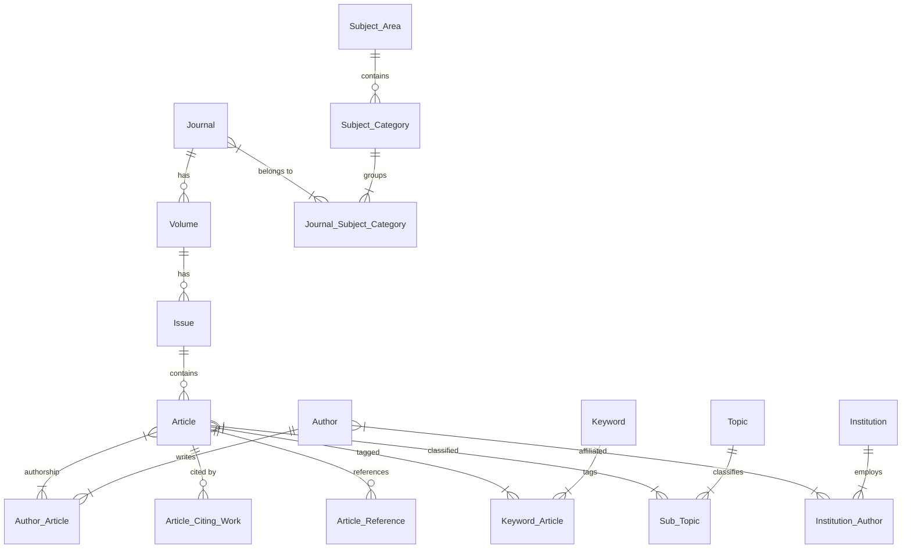

# BÁO CÁO KỸ THUẬT: SO SÁNH CƠ SỞ DỮ LIỆU SCIENCE JOURNAL (GLOBAL) VÀ SCIENCE JOURNAL VN

> **Ngày lập báo cáo:** 05/09/2026  
> **Nhánh gốc (Global Core):** `fix/connection_database` (hoặc `main`)  
> **Nhánh Việt Nam (Vietnam Vertical):** `hao/feature/paper-vn`  
> **Tác giả:** Antigravity Engineering Assistant  

---

## 1. Tóm Tắt Điều Hành (Executive Summary)

Hệ thống cơ sở dữ liệu của dự án hiện có 2 phiên bản phục vụ 2 phạm vi nghiệp vụ bổ trợ lẫn nhau:
1. **Nhánh Hiện Tại (`fix/connection_database`) - Global Academic Database:**
   * Tập trung vào kho dữ liệu học thuật **toàn cầu quy mô lớn** (~1.004.416 bài báo, ~1.99M tác giả, ~10.6M liên kết từ khóa) theo tiêu chuẩn Scimago 2025 (33.975 tạp chí thế giới).
   * Điểm mạnh: Dữ liệu lớn, xếp hạng Scimago (SJR, H-index, Quartile Q1–Q4), tích hợp vector embedding AI và tìm kiếm toàn văn trigram GIN.
2. **Nhánh Việt Nam (`hao/feature/paper-vn`) - Vietnam Trending Science Journal:**
   * Tập trung đi **chuyên sâu vào hệ sinh thái khoa học công nghệ Việt Nam** (Tạp chí khoa học trong nước, Trường Đại học & Viện nghiên cứu, Đồ thị trích dẫn nội địa).
   * Điểm mạnh: Định danh Viện/Trường (`Institution`), vị trí tác giả (`author_position`), link PDF toàn văn, quản lý trích dẫn hai chiều (`Article_Citing_Work`, `Article_Reference`).

> 💡 **Kết luận sáp nhập (Merge Feasibility):**  
> Nhánh VN được thiết kế theo mô hình **mở rộng cộng dồn (Additive Extension)**, kế thừa nguyên vẹn 100% các bảng cốt lõi của nhánh Global. Toàn bộ 24 bảng hiện tại của Global là tập con hợp lệ của nhánh VN. Do đó, **có thể hợp nhất 2 schema an toàn 100%** mà không gây xung đột hay phá vỡ 1.004.416 bài báo đã nạp trên DB Remote.

---

## 2. Bảng So Sánh Ma Trận Thực Thể (Entity Matrix - 28 Tables)

Dưới đây là ma trận đối chiếu toàn bộ các bảng trong 2 nhánh:

| STT | Bảng Dữ Liệu | Nhánh Global (`fix/connection_database`) | Nhánh VN (`hao/feature/paper-vn`) | Vai Trò & Phân Loại |
| :---: | :--- | :---: | :---: | :--- |
| 1 | `Zone` | ✅ Có | ✅ Có | Quốc gia & Vùng lãnh thổ (ISO) |
| 2 | `Subject_Area` | ✅ Có | ✅ Có | 27 Lĩnh vực nghiên cứu lớn (Scimago) |
| 3 | `Subject_Category` | ✅ Có | ✅ Có | 334+ Chuyên ngành hẹp |
| 4 | `Publisher` | ✅ Có | ✅ Có | Nhà xuất bản học thuật |
| 5 | `Ranking_Metric` | ✅ Có | ✅ Có | Chỉ số xếp hạng (SJR, H-Index, Docs, v.v.) |
| 6 | `Topic` | ✅ Có | ✅ Có | Chủ đề nghiên cứu chuẩn OpenAlex (4.507 topics) |
| 7 | `Journal` | ✅ Có | ✅ Có *(+ Cột mới)* | Danh mục Tạp chí khoa học |
| 8 | `Journal_Subject_Category` | ✅ Có | ✅ Có | Liên kết Tạp chí - Chuyên ngành |
| 9 | `Volume` | ✅ Có | ✅ Có | Tập san của tạp chí |
| 10 | `Issue` | ✅ Có | ✅ Có | Số phát hành trong tập |
| 11 | `Article` | ✅ Có | ✅ Có *(+ 8 Cột mới)* | Bài báo khoa học & Metadata |
| 12 | `Author` | ✅ Có | ✅ Có | Tác giả & Nhà khoa học |
| 13 | `Author_Article` | ✅ Có | ✅ Có *(+ Cột mới)* | Liên kết Bài báo - Tác giả |
| 14 | `Keyword` | ✅ Có | ✅ Có | Từ khóa học thuật |
| 15 | `Keyword_Article` | ✅ Có | ✅ Có | Trọng số từ khóa theo bài báo |
| 16 | `Sub_Topic` | ✅ Có | ✅ Có | Phân lớp chủ đề phụ của bài báo |
| 17 | `Journal_Ranking` | ✅ Có | ✅ Có | Lịch sử xếp hạng tạp chí theo năm |
| 18 | `Journal_Ranking_Subject_Category`| ✅ Có | ✅ Có | Quartile theo chuyên ngành của tạp chí |
| 19 | `Project` | ✅ Có | ✅ Có | Dự án nghiên cứu của người dùng |
| 20 | `Project_Journal` | ✅ Có | ✅ Có | Tạp chí được ghim trong Project |
| 21 | `Project_Keyword` | ✅ Có | ✅ Có | Từ khóa theo dõi trong Project |
| 22 | `Subject_Category_Project` | ✅ Có | ✅ Có | Chuyên ngành trọng tâm của Project |
| 23 | `user` | ✅ Có | ✅ Có | Tài khoản người dùng |
| 24 | `Password_Reset_Token` | ✅ Có | ✅ Có | Token bảo mật khôi phục mật khẩu |
| 25 | **`Institution`** | ❌ Chưa có | 🌟 **Có (Bảng mới)** | Viện nghiên cứu, Trường Đại học VN & Quốc tế |
| 26 | **`Institution_Author`** | ❌ Chưa có | 🌟 **Có (Bảng mới)** | Liên kết Tác giả - Cơ quan theo từng năm |
| 27 | **`Article_Citing_Work`** | ❌ Chưa có | 🌟 **Có (Bảng mới)** | Các bài báo trích dẫn bài báo VN |
| 28 | **`Article_Reference`** | ❌ Chưa có | 🌟 **Có (Bảng mới)** | Tài liệu trích dẫn bởi bài báo VN |

---

## 3. Chi Tiết Các Cột Dữ Liệu Khác Biệt (Column-Level Diff)

### 3.1. Bảng `Article` (Bài báo khoa học)
Bảng `Article` ở nhánh VN được mở rộng mạnh mẽ nhất để phục vụ cả việc tra cứu trực tuyến và đọc toàn văn:

```diff
  CREATE TABLE "Article" (
    "article_id"                           BIGINT GENERATED BY DEFAULT AS IDENTITY PRIMARY KEY,
    "version"                              varchar,
    "issue_id"                             bigint,
    "title"                                varchar NOT NULL,
    "abstract"                             varchar,
    "publication_year"                     int,
    "doi"                                  varchar,
    "primary_topic"                        bigint,
    "semantic_scholar_id"                  varchar,
    "citation_count"                       bigint,
    "semantic_influential_citation_count"  bigint,
    "semantic_external_ids"                jsonb,
    "semantic_tldr"                        varchar,
    "references"                           jsonb,
    "reference_count"                      bigint,
+   "openalex_id"                          varchar,        -- Mã OpenAlex chính thức (đưa vào DDL)
+   "landing_url"                          varchar,        -- URL trang chủ bài báo trên tạp chí
+   "pdf_url"                              varchar,        -- Link tải trực tiếp file PDF bài báo
+   "pages"                                varchar,        -- Số trang xuất bản (ví dụ: pp. 45-56)
+   "is_open_access"                       boolean,        -- Đánh dấu trạng thái Open Access
+   "citing_patents_count"                 bigint,         -- Số bằng sáng chế có trích dẫn bài báo
+   "citations_by_year"                    jsonb,          -- Lịch sử số lượt trích dẫn qua từng năm
+   "is_vn_journal"                        boolean DEFAULT false, -- CỜ NHẬN DIỆN BÀI BÁO TẠP CHÍ VN
    "created_at"                           timestamp DEFAULT CURRENT_TIMESTAMP,
    "is_deleted"                           boolean DEFAULT false
  );
```

### 3.2. Bảng `Author_Article` (Tác giả - Bài báo)
```diff
  CREATE TABLE "Author_Article" (
    "author_id"        bigint,
    "article_id"       bigint,
+   "author_position"  varchar, -- Vị trí tác giả: 'first', 'middle', 'last', 'corresponding'
    PRIMARY KEY ("author_id", "article_id")
  );
```
> **Tầm quan trọng:** Tại Việt Nam, quy định chấm điểm công trình của Hội đồng Giáo sư Nhà nước và Quỹ Nafosted phân biệt rất rõ giữa **Tác giả chính (First Author)**, **Tác giả liên hệ (Corresponding Author)** và các đồng tác giả. Cột này là điều kiện tiên quyết cho các tính năng học thuật tại VN.

### 3.3. Bảng `Journal` (Tạp chí)
```diff
  CREATE TABLE "Journal" (
    "journal_id"          BIGINT GENERATED BY DEFAULT AS IDENTITY PRIMARY KEY,
+   "owning_institution"  varchar, -- Cơ quan chủ quản (ĐHQG HN, Viện Hàn lâm KHCN, ĐHBK...)
    "source_id"           varchar,
    "publisher_id"        bigint,
    "country"             bigint,
    "region"              bigint,
    "display_name"        varchar NOT NULL,
    "type"                varchar,
    "is_open_access"      bool,
    "is_oa_diamond"       bool,
    "coverage"            varchar,
    "issn"                varchar,
    "created_at"          timestamp DEFAULT CURRENT_TIMESTAMP,
    "is_deleted"          boolean DEFAULT false
  );
```

---

## 4. Chi Tiết Các Bảng Mới Độc Quyền Của Nhánh VN

### 4.1. Bảng `Institution` (Viện Nghiên cứu / Trường Đại học)
Quản lý các trường đại học, viện nghiên cứu ở Việt Nam và quốc tế:
```sql
CREATE TABLE "Institution" (
  "institution_id" BIGINT GENERATED BY DEFAULT AS IDENTITY PRIMARY KEY NOT NULL,
  "openalex_id"    varchar UNIQUE,
  "display_name"   varchar NOT NULL,
  "country_code"   varchar,       -- 'VN', 'US', 'JP'...
  "type"           varchar,       -- 'education', 'facility', 'government', 'healthcare'...
  "created_at"     timestamp DEFAULT CURRENT_TIMESTAMP,
  "is_deleted"     boolean DEFAULT false,
  CONSTRAINT uq_institution_name_country_type UNIQUE ("display_name", "country_code", "type")
);
```

### 4.2. Bảng `Institution_Author` (Affiliation tác giả theo năm)
Theo dõi lịch sử công tác của nhà khoa học qua từng năm công bố:
```sql
CREATE TABLE "Institution_Author" (
  "author_id"      bigint NOT NULL,
  "institution_id" bigint NOT NULL,
  "year"           int NOT NULL,
  PRIMARY KEY ("author_id", "institution_id", "year"),
  FOREIGN KEY ("author_id") REFERENCES "Author"("author_id") ON DELETE CASCADE,
  FOREIGN KEY ("institution_id") REFERENCES "Institution"("institution_id") ON DELETE CASCADE
);
```

### 4.3. Bảng `Article_Citing_Work` (Công trình trích dẫn)
Lưu trữ các bài báo trong nước hoặc quốc tế có trích dẫn bài báo VN:
```sql
CREATE TABLE "Article_Citing_Work" (
  "article_id"        bigint NOT NULL,
  "openalex_work_id"  varchar NOT NULL,
  "citing_article_id" bigint,             -- Map tới article_id nội bộ nếu bài trích dẫn cũng nằm trong DB
  "doi"               varchar,
  "title"             text,
  "publication_year"  int,
  "source_name"       varchar,
  "source_url"        text,
  "landing_url"       text,
  "pdf_url"           text,
  "cited_by_count"    bigint,
  "type"              varchar,
  "authors"           jsonb,
  "raw"               jsonb,
  "created_at"        timestamp DEFAULT CURRENT_TIMESTAMP,
  "updated_at"        timestamp DEFAULT CURRENT_TIMESTAMP,
  PRIMARY KEY ("article_id", "openalex_work_id"),
  FOREIGN KEY ("article_id") REFERENCES "Article"("article_id") ON DELETE CASCADE,
  FOREIGN KEY ("citing_article_id") REFERENCES "Article"("article_id") ON DELETE SET NULL
);
```

### 4.4. Bảng `Article_Reference` (Tài liệu trích dẫn)
Lưu trữ danh sách tài liệu tham khảo của bài báo VN:
```sql
CREATE TABLE "Article_Reference" (
  "article_id"            bigint NOT NULL,
  "reference_key"         varchar NOT NULL,
  "openalex_work_id"      varchar,
  "referenced_article_id" bigint,         -- Map tới article_id nội bộ nếu tài liệu tham khảo có sẵn trong DB
  "doi"                   varchar,
  "title"                 text,
  "publication_year"      int,
  "source_name"           varchar,
  "authors"               jsonb,
  "created_at"            timestamp DEFAULT CURRENT_TIMESTAMP,
  "updated_at"            timestamp DEFAULT CURRENT_TIMESTAMP,
  PRIMARY KEY ("article_id", "reference_key"),
  FOREIGN KEY ("article_id") REFERENCES "Article"("article_id") ON DELETE CASCADE,
  FOREIGN KEY ("referenced_article_id") REFERENCES "Article"("article_id") ON DELETE SET NULL
);
```

---

## 5. Biểu Đồ Thực Thể Liên Kết (Mermaid ERD)



---

## 6. So Sánh Về Pipeline & Công Cụ (ETL / Sync Stack)

| Hạng mục | Nhánh Hiện Tại (`fix/connection_database`) | Nhánh VN (`hao/feature/paper-vn`) |
| :--- | :--- | :--- |
| **Engine Crawl chính** | `tools/openalex_sync.py` (Crawl theo mảng Work của từng Journal quốc tế) | `tools/vn_journals/` (Crawl OJS, Lens, và OpenAlex riêng cho tạp chí VN) |
| **Cơ chế nạp DB** | Chunked Bulk Insert (`psycopg2.extras.execute_values`), tốc độ 8.000 - 10.000 r/s | Batch insert + kiểm soát deduplicate đa unique key (`uq_institution_name_country_type`) |
| **Phân tích quan hệ** | Neo4j Graph Export (`Tool-pg-to-neo4j`) & Meilisearch Sync (`pg-to-melisearch`) | Đồ thị trích dẫn đệ quy SQL (`crawl_recursive_graph.py`, `Article_Citing_Work`) |
| **Vector AI** | `embedding-tool/embed_database.py` (Tạo vector embedding cho 1M bài báo bằng Ollama/Nomic) | Chưa tích hợp vector embedding |

---

## 7. Kịch Bản Sáp Nhập Schema Hợp Nhất (Unified Migration SQL)

Nếu muốn đưa toàn bộ tính năng và bảng của nhánh VN vào cơ sở dữ liệu hiện tại mà **không làm mất hay gián đoạn 1.004.416 bài báo đang chạy**, chỉ cần thực thi script SQL an toàn sau:

```sql
-- ====================================================================
-- UNIFIED MIGRATION SCRIPT: GLOBAL DB -> VIETNAM VERTICAL COMPLIANT
-- Không làm mất dữ liệu, an toàn với 1M bài báo hiện có.
-- ====================================================================

-- 1. Bổ sung các cột mở rộng cho Article
ALTER TABLE "Article" ADD COLUMN IF NOT EXISTS "openalex_id" varchar;
ALTER TABLE "Article" ADD COLUMN IF NOT EXISTS "landing_url" varchar;
ALTER TABLE "Article" ADD COLUMN IF NOT EXISTS "pdf_url" varchar;
ALTER TABLE "Article" ADD COLUMN IF NOT EXISTS "pages" varchar;
ALTER TABLE "Article" ADD COLUMN IF NOT EXISTS "is_open_access" boolean;
ALTER TABLE "Article" ADD COLUMN IF NOT EXISTS "citing_patents_count" bigint;
ALTER TABLE "Article" ADD COLUMN IF NOT EXISTS "citations_by_year" jsonb;
ALTER TABLE "Article" ADD COLUMN IF NOT EXISTS "is_vn_journal" boolean DEFAULT false;

-- 2. Bổ sung vị trí tác giả cho Author_Article
ALTER TABLE "Author_Article" ADD COLUMN IF NOT EXISTS "author_position" varchar;

-- 3. Bổ sung cơ quan chủ quản cho Journal
ALTER TABLE "Journal" ADD COLUMN IF NOT EXISTS "owning_institution" varchar;

-- 4. Tạo bảng Institution (Viện / Trường)
CREATE TABLE IF NOT EXISTS "Institution" (
  "institution_id" BIGINT GENERATED BY DEFAULT AS IDENTITY PRIMARY KEY NOT NULL,
  "openalex_id"    varchar UNIQUE,
  "display_name"   varchar NOT NULL,
  "country_code"   varchar,
  "type"           varchar,
  "created_at"     timestamp DEFAULT CURRENT_TIMESTAMP,
  "is_deleted"     boolean DEFAULT false,
  CONSTRAINT uq_institution_name_country_type UNIQUE ("display_name", "country_code", "type")
);

-- 5. Tạo bảng liên kết Institution_Author
CREATE TABLE IF NOT EXISTS "Institution_Author" (
  "author_id"      bigint NOT NULL,
  "institution_id" bigint NOT NULL,
  "year"           int NOT NULL,
  PRIMARY KEY ("author_id", "institution_id", "year")
);

DO $$
BEGIN
  IF NOT EXISTS (SELECT 1 FROM pg_constraint WHERE conname = 'fk_inst_author_author') THEN
    ALTER TABLE "Institution_Author"
      ADD CONSTRAINT "fk_inst_author_author"
      FOREIGN KEY ("author_id") REFERENCES "Author"("author_id") ON DELETE CASCADE;
  END IF;
  IF NOT EXISTS (SELECT 1 FROM pg_constraint WHERE conname = 'fk_inst_author_inst') THEN
    ALTER TABLE "Institution_Author"
      ADD CONSTRAINT "fk_inst_author_inst"
      FOREIGN KEY ("institution_id") REFERENCES "Institution"("institution_id") ON DELETE CASCADE;
  END IF;
END $$;

-- 6. Tạo bảng Article_Citing_Work (Đồ thị trích dẫn)
CREATE TABLE IF NOT EXISTS "Article_Citing_Work" (
  "article_id"        bigint NOT NULL,
  "openalex_work_id"  varchar NOT NULL,
  "citing_article_id" bigint,
  "doi"               varchar,
  "title"             text,
  "publication_year"  int,
  "source_name"       varchar,
  "source_url"        text,
  "landing_url"       text,
  "pdf_url"           text,
  "cited_by_count"    bigint,
  "type"              varchar,
  "authors"           jsonb,
  "raw"               jsonb,
  "created_at"        timestamp DEFAULT CURRENT_TIMESTAMP,
  "updated_at"        timestamp DEFAULT CURRENT_TIMESTAMP,
  PRIMARY KEY ("article_id", "openalex_work_id")
);

-- 7. Tạo bảng Article_Reference (Tài liệu tham khảo)
CREATE TABLE IF NOT EXISTS "Article_Reference" (
  "article_id"            bigint NOT NULL,
  "reference_key"         varchar NOT NULL,
  "openalex_work_id"      varchar,
  "semantic_scholar_id"   varchar,
  "doi"                   varchar,
  "title"                 text,
  "publication_year"      int,
  "source_name"           varchar,
  "source_url"            text,
  "landing_url"           text,
  "pdf_url"               text,
  "cited_by_count"        bigint,
  "type"                  varchar,
  "authors"               jsonb,
  "raw"                   jsonb,
  "referenced_article_id" bigint,
  "created_at"            timestamp DEFAULT CURRENT_TIMESTAMP,
  "updated_at"            timestamp DEFAULT CURRENT_TIMESTAMP,
  PRIMARY KEY ("article_id", "reference_key")
);

-- Indexes tối ưu hiệu năng truy vấn
CREATE INDEX IF NOT EXISTS "idx_article_vn_flag" ON "Article" ("is_vn_journal");
CREATE INDEX IF NOT EXISTS "idx_article_openalex_id" ON "Article" ("openalex_id");
CREATE INDEX IF NOT EXISTS "idx_inst_author_author_id" ON "Institution_Author" ("author_id");
CREATE INDEX IF NOT EXISTS "idx_inst_author_institution_id" ON "Institution_Author" ("institution_id");
CREATE INDEX IF NOT EXISTS "idx_citing_work_article" ON "Article_Citing_Work" ("article_id");
CREATE INDEX IF NOT EXISTS "idx_reference_article" ON "Article_Reference" ("article_id");
```

---

## 8. Tóm Tắt Khuyến Nghị Thực Thi

1. **Khẳng định tính tương thích:** Database hiện tại và nhánh VN hoàn toàn có thể song hành hoặc gộp làm một thể thống nhất.
2. **Khuyến nghị lộ trình:**
   * **Bước 1:** Áp dụng `UNIFIED MIGRATION SCRIPT` ở Mục 7 lên Database ResearchPulse Remote để nâng cấp schema lên phiên bản tương thích hoàn toàn cả 2 nhánh (mất ~5 giây).
   * **Bước 2:** Chạy công cụ `tools/vn_journals/import_full_journal_supabase.py` hoặc các crawler chuyên sâu của VN để đổ dữ liệu các tạp chí trong nước và liên kết Viện/Trường vào hệ sinh thái 1M bài báo hiện tại.
   * **Bước 3:** Tiếp tục khai thác song song cả tính năng phân tích xu hướng quốc tế (Scimago Global Trends) và xếp hạng/tra cứu nghiên cứu học thuật Việt Nam trên cùng một cơ sở dữ liệu duy nhất.
